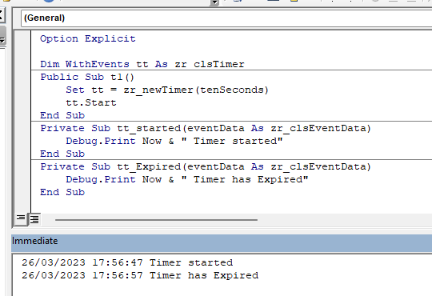

# ZR Timers

This project provides and implementation of timer objects for use in MS-Excel macro-enabled spreadsheets.

Timer objects emit events timed at intervals specified by the user. These timed events can be monitored by functions written in Worksheet and Class modules. Any number of different timers firing at different intervals can be created.

All implementation is in vba, all source code is included. Implementation of the timer uses Application.OnTime at the core to provide the event generation, but setting and resetting Application.OnTime is handled implicitly and is hidden from the application programmer.

##### Why use ZR_Timers?

* Excel's in-built Application.OnTime function is limited to executing a single function defined in a vba Module or a Worksheet. It is unable to execute a function within an instance of a class defined in an Excel Class Module.
* Writing code to handle setting and resetting timers, and handling timer expiry is complex and prone to problems. Timer handling functions must be referred to by name passed as a string, so are not subject to syntax checking.
* Events emitted by ZR Timer objects can be monitored in any workbook or class module. Events use the vba **WithEvents** syntax which ensures compile-time validation. Multiple handlers can be defined for events emitted by a single Timer object.
* ZR Timer implements event queue management which means efficient event generation, regardless of how many Timer objects are created. This reduces overhead and ensures orderly execution of event handling functions.

**Questions?**

If you have any problems or questions please email me on jbrc@tigersoftware.co.uk

## Summary of features

* Timers are created as vba objects. Events are handled by using **WithEvents** syntax.
* Timers may fire **Tick events** at a regular inteval >= 1 second.
* Timer **Expiry** is set as:
  * a period of time from .Start call or
  * a fixed point in time, regardless of when .Start is called.
* Timers may be Paused and Continued. During Pause, Tick events are suppressed. Pausing does not affect expiry.
* Timers emit events on change of state. Possible events are: **Started**, **Tick**, **Expired**, **Paused**, **Continued**, **Cancelled**.

## Files in the ZR_Timers repository

1. ReadMe.md
   * This document
2. zr_Constants.bas
   * Globally-defined constants for use with the zr_Timers system
3. zr_Core.bas
   * Globally-defined methods giving access to objects within the system
4. zr_Timers.xlsm
   * Excel macro-enabled sheet containing all modules and some example worksheets and forms
   * Also can be used as a free-standing project which other Excel projects may reference
5. zr_clsAppTimer.cls
   * Class module used internally in the system. Not used directly by applications
6. zr_clsEventData.cls
   * Event data class that is used as the single paramter passed in all events emitted by Timers
7. zr_clsLog.cls
   * Logger that can provide event-driven access to log messages generated by the timer system.
   * Used in debugging internals of the system.
8. zr_clsStream.cls
   * Event streaming objects which collect and re-emit events from all timers having the same streamLabel
   * Applications can obtain a specific instance then monitor events raised under that streamLabel without needing to know anything about the Timers that are issuing the events.
9. zr_clsTickEntry.cls
   * Class module used internally by the system. Not used directly by applications
10. zr_clsTickQueue.cls
    * Class module used internally by the system. Not used directly by applications
11. zr_clsTimer.cls
    * Class implementing the Timer functionality for use by applications. A new Timer instances is obtained by a call to the Core function zr_newTimer().
    * Events are monitored by using WithEvents syntax with the Timer object and then defining handlers for different event types.

## How to install

**Method 1 - Incorporate source modules into your Excel application**

This has the advantage that all code is included in your application, so it does not require reference to the zr_Timers project

1. Download all source modules (.cls [7 files] and .bas [2 files]) from GitHub to a local folder
2. Open your Excel application spreadsheet. Open the vba editor. In the project explorer, import all nine source modules into the application.
3. Use the zr_timer methods in your application to create and run timers.

**Method 2 - Refer to the zr_Timers project**

1. Download the Excel spreadsheet zr_Timers.xlsm from GitHub to a local folder
2. Open zr_Timers.xlsm and enable macros
3. Open your application Excel spreadsheet. Open the vba code window, click on your application in the project navigation pane, then
   * Choose Tools>References.
   * In the list of Available References find zr_Timers and set the check box
4. Now use the zr_Timers methods in your application. You may need to qualify references by prefixing calls with **zr_Timers**.

##### Example code

# Programming guide

## Core methods

These methods and properties are members of the zr_Core module. They are globally available

| Method      | Parameters                                                              | Notes                                                                                                                                                                   |
| :------------ | :------------------------------------------------------------------------ | ------------------------------------------------------------------------------------------------------------------------------------------------------------------------- |
| zr_start    | None                                                                    | Initialises the timer system. Is called implicitly by most other core methods.                                                                                          |
| zr_newTimer | timeToExpiry [o date], expiryDateTime [o date], tickerInterval [o date] | All arguments are optional. There are methods that correspond to these arguments which can be set separately.  Returns a new Timer object with the given settings. |

## Timer methods

These methods and properties are members of the class zr_clsTimer. They are invoked on an instance of the class.

| Method              | Parameters         | Notes                                                                                                                                                                                                                                                                                                                                                     |
| :-------------------- | -------------------- | :---------------------------------------------------------------------------------------------------------------------------------------------------------------------------------------------------------------------------------------------------------------------------------------------------------------------------------------------------------- |
| Start               | None               | Starts the timer. The expiry time is calculated on start. Tick events will be issued at intervals specified using**tickerInterval** method.                                                                                                                                                                                                               |
| Pause               | None               | Pauses a timer if it is running. During pause no Tick or Expired events are emitted. The Expiry date/time are not affected by pause. If expiry time is passed during pause, the Expired event will be emitted as soon as Continue method is called.                                                                                                       |
| Continue            | None               | Continues the timer after a pause. Tick and Expired events will be issued after Continue has been called                                                                                                                                                                                                                                                  |
| Cancel              | None               | Stops the timer and removes it from the timer system. The Cancelled event is emitted.                                                                                                                                                                                                                                                                     |
| lifeTime            | pLifeTime [m date] | The parameter sets the period of time that is to elapse between Start and Expiry. The period starts when Start method is called. If the timer is already running, it will run for the life time starting from now.                                                                                                                                        |
| expiresAt           | pExpiryDateTime    | The parameter sets the exact date and time when the timer will expire. This is fixed and will not depend on when Start was called.                                                                                                                                                                                                                        |
| tickerInterval      | pTickerInterval    | The parameter specifies the time period to elapse between ticks. Minimum time is 1 second.                                                                                                                                                                                                                                                                |
| userData [property] | ud [m object]      | Specifies any object that contains data to be passed in events emitted by this timer. The object is referenced dynamically so subsequent changes made to any properties of the object will be reflected on later events emitted by the timer. May be set to Nothing. May be set while the timer is running. Syntax: Set oTimer.userData = userDataObject. |
| ID                  |                    | Returns a long integer that is a unique identifier of this Timer instance.                                                                                                                                                                                                                                                                                |

## Constants

These constants are globally-defined in the module zr_Contants.bas. Within the system a "tick" represents a time period of one second. This is the minmum time unit that the system can handle.

| Constant       | Value     | Notes                                                                                                  |
| ---------------- | ----------- | -------------------------------------------------------------------------------------------------------- |
| MaxTickNumber  | 999999999 | Represents a point in time about 30 years from the start time of the system, used to represent "Never" |
| NullTickNumber | -99       | Represents "Not set to any value" in a tick number field                                               |
| SecondsPerDay  | 86400     | Number of seconds in a day                                                                             |
| OneSecond      | 00:00:01  | A date constant of one second in length                                                                |
| FiveSeconds    | 00:00:05  |                                                                                                        |
| TenSeconds     | 00:00:10  |                                                                                                        |
| OneMinute      | 00:01:00  |                                                                                                        |
| FiveMinutes    | 00:05:00  |                                                                                                        |
| OneHour        | 01:00:00  |                                                                                                        |
| set o          |           |                                                                                                        |
